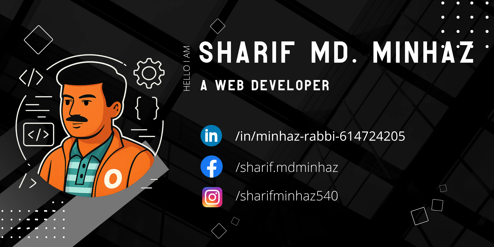
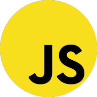
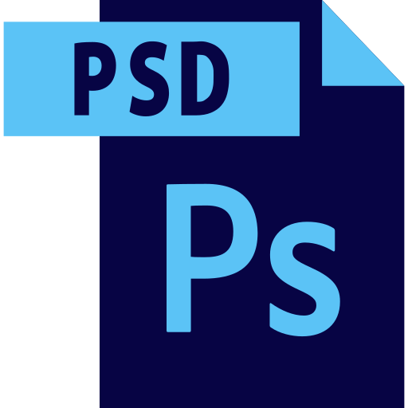
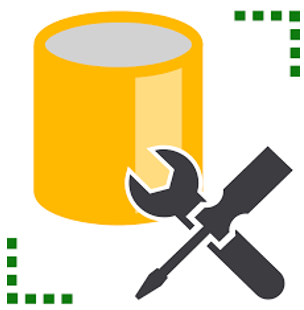
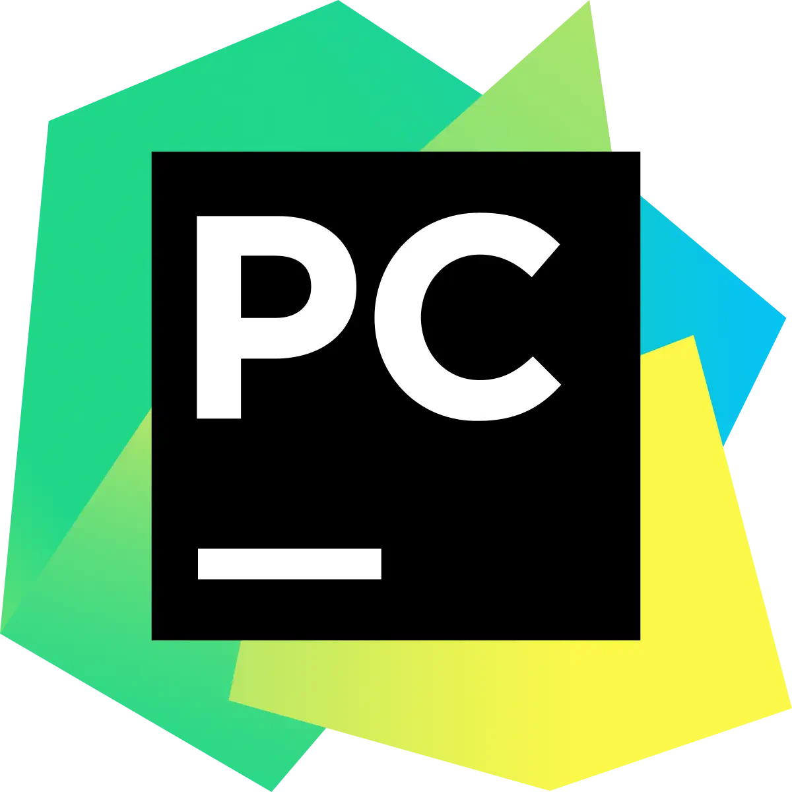
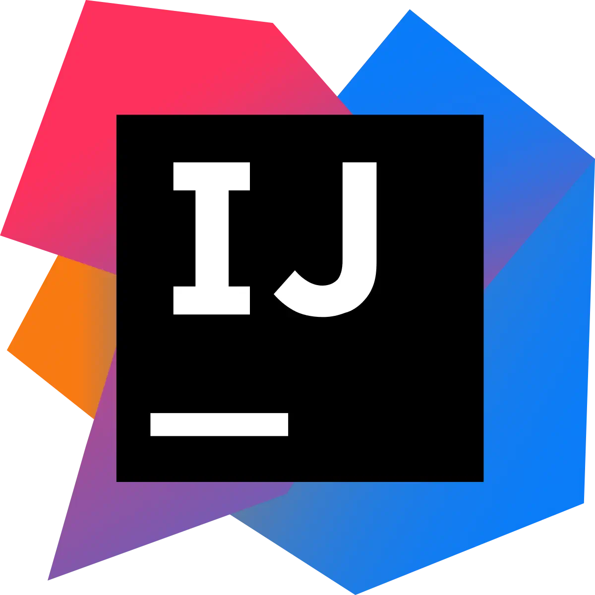
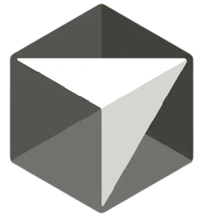
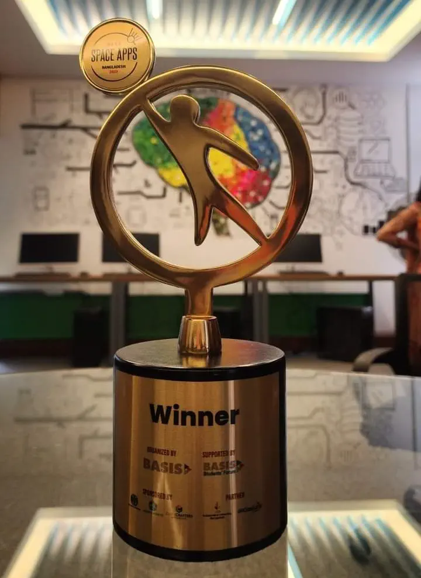

<!-- banner image starts here  -->

<!-- banner image ends here  -->

<h1> 👋 Hello, I'm Sharif Md. Minhazur Rahman Rabbi </h1>

A skilled web developer & passionate learner.
🏠 &nbsp; Living: Mathbaria, Pirojpur

💖 &emsp;I enjoy programming and sharing knowledge  
💻 &emsp;Most used line of code `console.log("Hello World")`  
🤔 &emsp;I’m looking for people who can enlighten me with the amazing programming knowledge. 
📧 &emsp;How to reach me: smmr.career@gmail.com. 
🤩 &emsp;Favorite Stack: MERN (MongoDB, Express, React, Node).  
⚡ &emsp;Fun fact: I don’t quit scared—I lose trying.
 
 

<!-- Contact me section starts here  -->

   
   
   
   

 
<!-- Contact me section ends here  -->

<!-- about-me section starts here  -->

### 👨‍🏫 &nbsp; About Me

Jr. Software Engineer at Right Brain Solution Ltd, working with React, Node.js, and Electron.js.
I transitioned from a passionate learner to building real-world applications, focusing on performance, scalability, and clean architecture.
Always exploring new technologies and sharing what I learn along the way.

<!-- about-me section ends here  -->

<!-- web-related skills section starts here  -->

### 👨🏽‍💻 &nbsp; My Skills:

<!-- Key skill here on web development  -->

#### Key Skills in Web Development:

 
 

<!-- about my work -->

|  |  |
| ------------------------------------------------------------------------------------------------------------------------------------------------------------------------------------------------------------------------------------ | -------------------------------------------------------------------------------------------------------------------------------------------------------------------------------------------------------------------------------- |

 
<!-- GitHub profile trophy -->

  

 
<!-- GitHub streak-->

<!-- web-related skills section ends here  -->
<!-- other skills for computer science section starts here  -->

#### Other Skills:

    
    
    
    
    
    

 

- Figma to UI
- PSD to UI
- Database System
- Object Oriented Programming
- Java Swing
- Operating Systems (Ubuntu, Windows)
- Deployment (VPS)
- MS Word

<!-- other skills and my videos for the computer science section end here  -->
 

### 💻 &nbsp;IDE & Code-Editors I Use:

    
    
    
    
    
    
    
    
    

 

note: more tools to come.

<!-- other skills and my videos for the computer science section start here  -->

<!-- work experience section starts here  -->

### 💼 &nbsp; Employment History

| Position              | Institute                    | Duration                  | Location       |
| --------------------- | ---------------------------- | ------------------------- | -------------- |
| Jr. Software Engineer | Right Brain Solution Ltd.    | November 2024 - (current) | Uttara, Dhaka  |
| Full Stack Developer  | International Affairs at DIU | July - December, 2023     | Ashulia, Savar |

<!-- work experience section ends here  -->
<!-- education section starts here  -->
 

### 👨🏻‍🎓 &nbsp; Education

1. B.Sc. in Software Engineering (2020-2024)  
   Daffodil International University  
   Dhanmondi, Dhaka.
2. H.S.C  
   Residential Laboratory College (2017-2019)
   Khilkhet, Dhaka.
3. S.S.C  
    K.M Latif Institution (2016-2017)  
   Mathbaria, Pirojpur.

<!-- education section ends here  -->

<!-- my languages section starts here  -->

### 💬 &nbsp; Languages:

- 🇧🇩 Bangla: Native
- 🏴󠁧󠁢󠁥󠁮󠁧󠁿 English: Advanced

<!-- my languages section ends here  -->

---

<!-- my problem-solving section starts here  -->

### 🧠&nbsp; Problem-solving on LeetCode:

<!-- my problem-solving section ends here  -->

<!-- my sports and game section starts here  -->

### 🎯 &nbsp; Sports / Game / Activities / Hobby:

- 🏏 Cricket, ♟️ Chess, 🎮 Gaming
- 🌐 API Designing, 🎥 Watching Movies
- 🏊‍♂️ Swimming, 🚶‍♂️ Walking
  <!-- my sports and games section ends here  -->
  <!-- Honors & awards section starts here  -->
   

### 🏆 Honors & Awards :

 

NASA Space App Challenge 2023 Champion  
Project: Titan Settlers  
Region: Barisal, Team: The Titans

#### Profile Visits

---

Thanks for going through my Portfolio.
All rights reserved by Sharif Minhaz @2021-2026

---

[github]: https://github.com/Sharif-Minhaz
